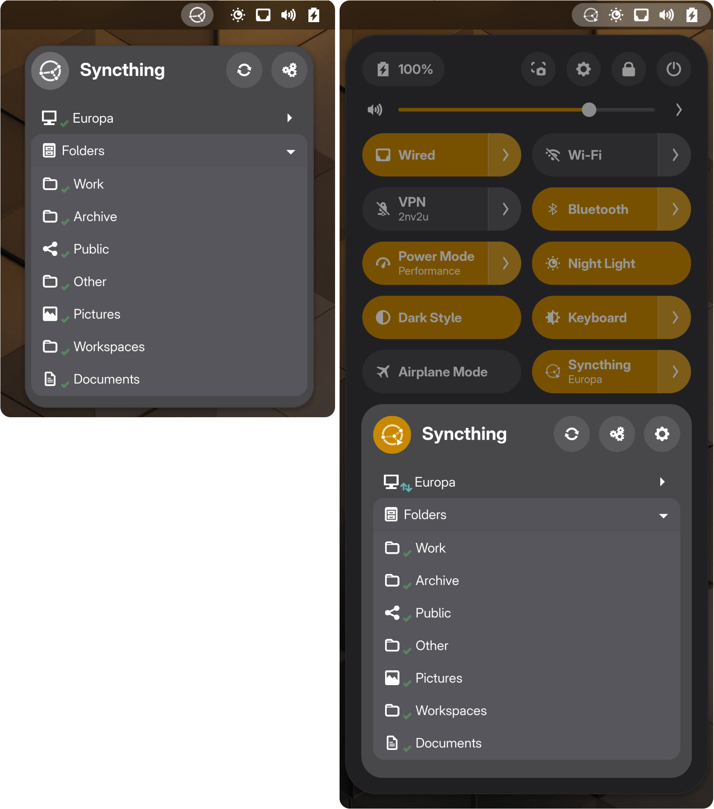

#  Gnome Shell - Syncthing Indicator 

Shell indicator for starting, monitoring and controlling the Syncthing daemon using SystemD

What is [Syncthing](https://syncthing.net/)?

Please note that this extension does not install Syncthing itself, refer the guide on the Syncthing website for more information

## Installation from gnome extension website
https://extensions.gnome.org/extension/1070/syncthing-indicator/

## Manual installation
 1. `git clone https://github.com/2nv2u/gnome-shell-extension-syncthing-indicator.git`
 1. `./gnome-shell-extension-syncthing-indicator/install.sh`
 1. Restart shell or log out & log in

## Debugging during development
`clear && export G_MESSAGES_DEBUG=all && dbus-run-session -- gnome-shell --nested --wayland | grep syncthing-indicator`